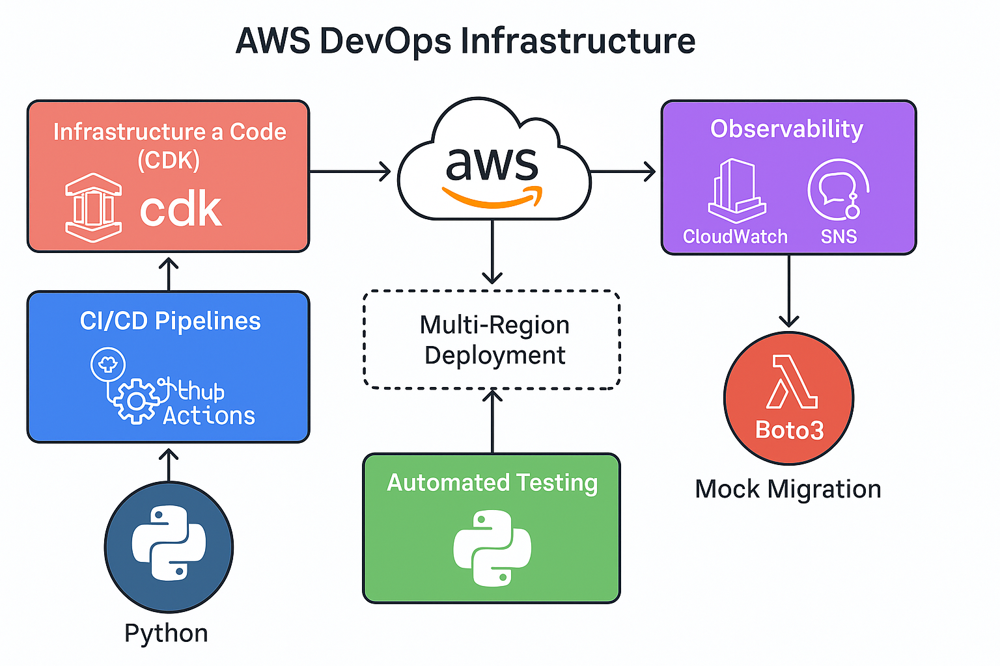

# AWS DevOps Project

## Overview

This project demonstrates a real-world AWS DevOps infrastructure using AWS CDK, Python, and GitHub Actions. It includes:
- Infrastructure as Code (CDK)
- CI/CD Pipelines
- Automated testing
- Observability with CloudWatch and SNS
- Multi-region deployment
- Mock migration using Boto3

## Architecture



## Project Structure

```
aws-devops-project/
├── cdk/
│   ├── app.py
│   ├── networking_stack.py
│   ├── compute_stack.py
│   ├── observability_stack.py
│   └── tests/
├── scripts/
│   └── migrate_rds_snapshot.py
├── .github/workflows/
│   └── deploy.yml
├── diagrams/
│   └── aws_devops_infrastructure_diagram.png
├── .gitignore
└── README.md
```

## How to Use

1. Install AWS CDK and initialize environment
2. Run `cdk deploy` to deploy infrastructure
3. Modify `deploy.yml` to match your GitHub repo
4. Add test coverage in `tests/`

## Requirements

- AWS CDK (Python)
- GitHub Actions
- Python 3.9+
- AWS CLI configured
